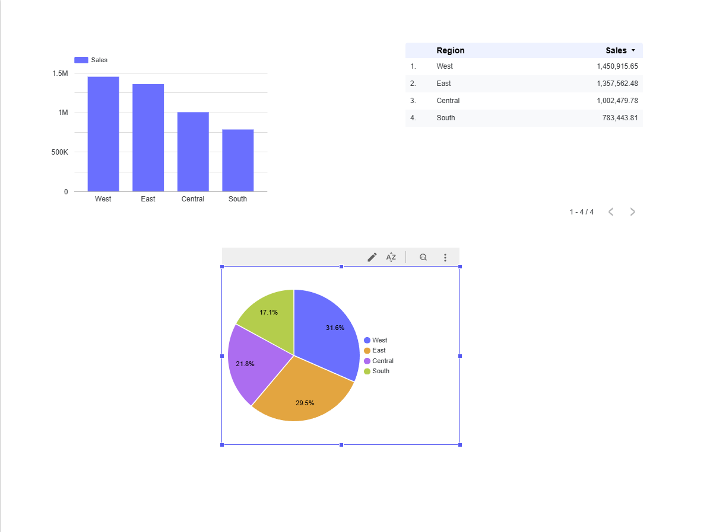

# ☁️ Cloud Sales Analytics Pipeline

A full end-to-end sales data analytics project built using Google Cloud Platform (GCP).  
This project demonstrates modern cloud data skills including data ingestion, cleaning, aggregation, cloud data warehousing, and dashboard visualization.

---

## 🚀 Project Overview

This project ingests raw sales data into Google Cloud Storage, processes and aggregates it using Python in Google Colab, loads the results into BigQuery, and visualizes the insights with Looker Studio (Google Data Studio).

**Key Skills Demonstrated:**  
- Cloud data pipelines
- Data cleaning & transformation (Pandas)
- Cloud data warehousing (BigQuery)
- Business analytics dashboards (Looker Studio)

---

## 🛠️ Tech Stack

- **Google Cloud Platform (GCP)**
  - Cloud Storage
  - BigQuery
- **Python** (Google Colab)
- **Pandas**
- **Looker Studio** (Google Data Studio)

---

## 📂 Project Structure

```
cloud-sales-analytics-pipeline/
├── data/
│   └── Sample-Superstore.csv
├── images/
│   └── sales_by_region.png
├── sales_analytics_gcp.ipynb
├── README.md
├── LICENSE
└── Sales_by_region.pdf
```

---

## 🔗 Quick Links

- [Colab Notebook (viewable)](link-to-your-notebook-if-public)
- [Looker Studio Dashboard (viewable)](link-to-dashboard-if-public)

---

## ⚡ How It Works

1. **Upload raw sales CSV to Google Cloud Storage.**
2. **Process and aggregate data in Google Colab using Pandas.**
3. **Load the cleaned data into BigQuery.**
4. **Visualize insights in Looker Studio (sales by region, etc.).**

---

## 📊 Sample Dashboard


---

## 📝 Key Insights

- Identified sales trends by region from the Superstore dataset.
- Built a reproducible cloud-based pipeline, easily scalable for larger data.
- Created shareable, interactive business dashboards for reporting.

---

## 🏁 How to Reproduce

1. **Fork or clone this repo.**
2. Open `cloud_sales_analytics_pipeline.ipynb` in Google Colab.
3. Update variables with your own GCP project, bucket, and dataset names.
4. Upload your own sales data or use the [Superstore Dataset](https://www.kaggle.com/datasets/vivek468/superstore-dataset-final).
5. Follow the notebook steps to process, upload, and visualize your data.

---

## 📬 Contact

Made by [Musaib Nagani](https://github.com/MusaibNagani).  
Feel free to connect on [LinkedIn](https://www.linkedin.com/in/musaib-nagani/)!
